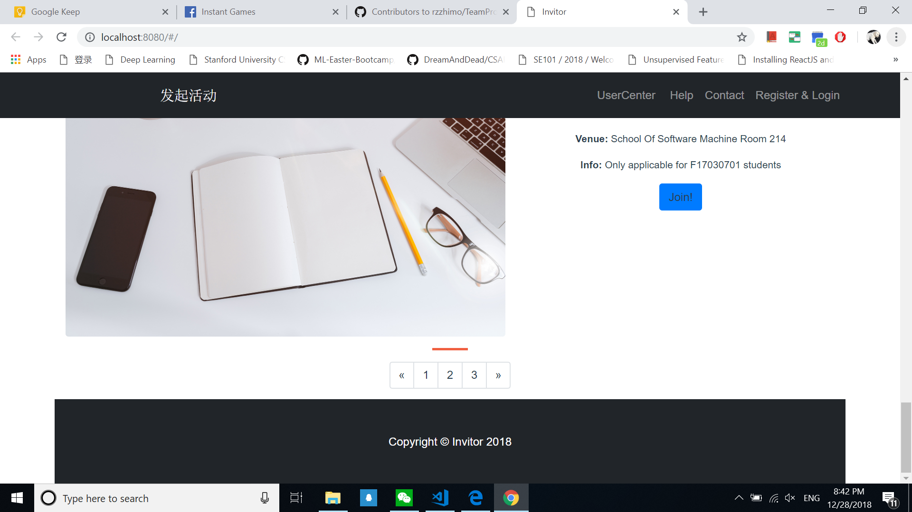

# Invitor

A reactive mini-invitation-network created with Vue!!

## Introduction

University is a new environment for us. Unfortunately, student often lack of a medium to invite friends for activities such as sport, studying, singing or even simple task like eating lunch together. This is further confirmed after we have distributed questions for our housemates, coursemates and discussion with course teacher. This is why we are here to change the situation by mean of software(web application).

## Screenshots





## Usage

1. First install all dependencies:

```
# with npm package manager
> npm install
```

2. Start the server:

```
> npm start 
[OR] 
> npm run dev
```

3. Now run the app:

```
# In browser, visit:
http://localhost:8080/#/
```

4. Enjoy!

## Feature Request

Due to time constraint and lack of required skillsets among our us, we only manage to produce front-end of this web application.

However, feel free to open an issue to ask for a new feature support.

## Contribution

> rzzhimo
> kmykoh97
> GHB123123

## Special Thanks

Ren Rui from School of Software Engineering Shanghai Jiao Tong University for guiding us throughout this project.